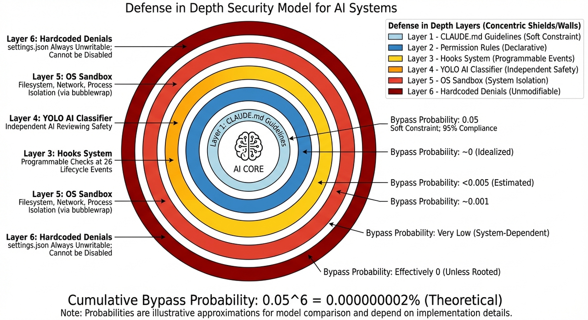
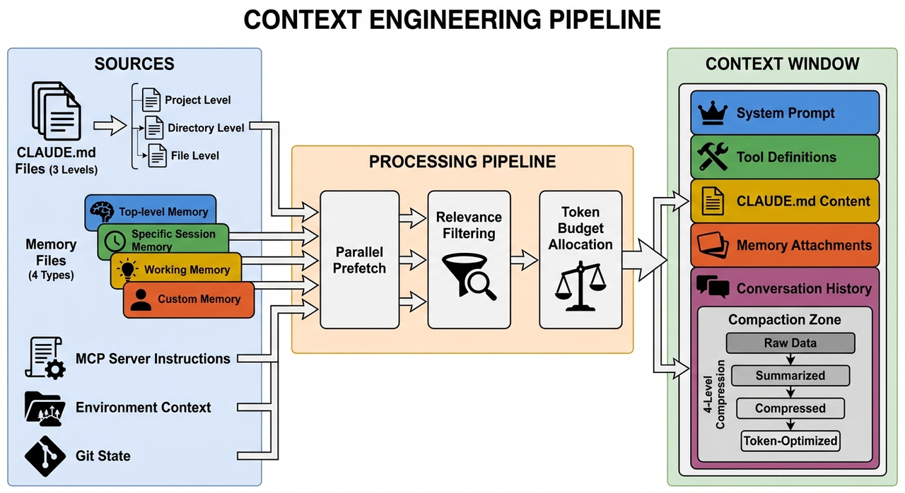
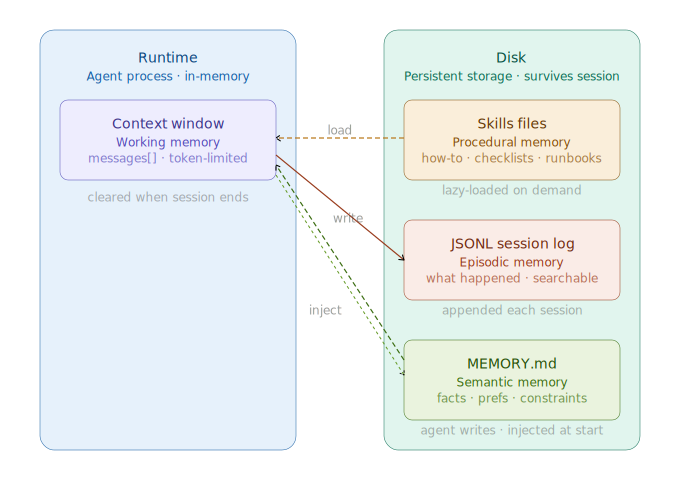
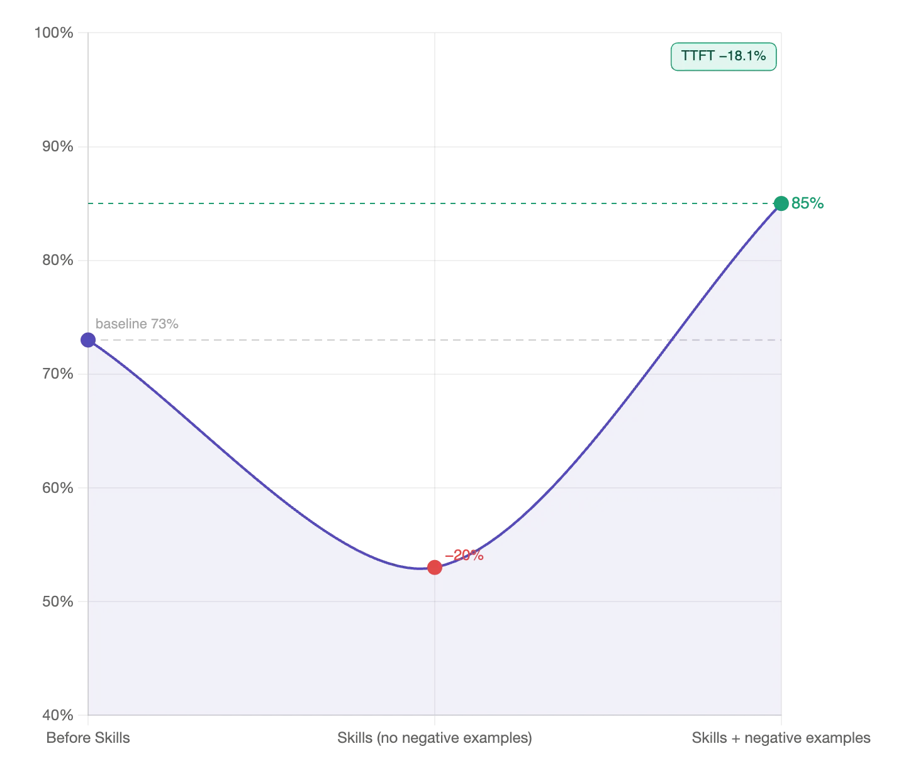

# Claude Code Harness

## Background

From prompt engineering (single interactions) to context engineering to harness, the driving forces are:

1. Applying uncertain intelligence to deterministic production workflows
2. More efficient information organization
3. Reflecting stronger model capabilities
4. The shifting role of humans

Harness also represents a mindset shift: the default model is already very capable, and humans are gradually becoming the bottleneck in system efficiency.

---

## Agent Loop

The essence of an Agent is a `while true` loop: **Perceive → Decide → Act → Feedback**.

Most Agent systems are compositions of these 5 patterns:

1. **Prompt Chaining**: Break tasks into sequential steps where each LLM processes the previous step's output / optional code checkpoints in between / suited for linear workflows like generate-then-translate or outline-then-draft
2. **Routing**: Classify input and direct it to a specialized processing pipeline / simple queries go to a lightweight model, complex ones go to a stronger model / tech support and billing inquiries follow different logic paths
3. **Parallelization**: Two variants — partitioning splits tasks into independent subtasks that run concurrently; voting runs the same task multiple times and takes consensus / ideal for high-stakes decisions or scenarios requiring multiple perspectives
4. **Orchestrator-Workers**: A central LLM dynamically decomposes tasks, delegates to worker LLMs, and synthesizes results / Claude Code's spawn tool and subagent mode follow this archetype
5. **Evaluator-Optimizer**: The generator produces output, the evaluator gives feedback, and the loop continues until the quality threshold is met / suited for tasks like translation or creative writing where quality standards are hard to precisely define in code





---

## Permissions

### What Claude Code Can See

- **Project files**: Files in the directory and its subdirectories, plus approved files in other locations
- **Terminal**: Any command you can run — build tools / git / package managers / system utilities / scripts
- **Git state**: Current branch / uncommitted changes / recent commit history
- **CLAUDE.md**: How humans guide Claude's behavior
- **Auto memory**: Claude automatically saves learning outcomes (project patterns and preferences) while working / MEMORY.md's first 200 lines or 25KB are loaded at the start of each session

### Permission Modes

There are 7 permission modes, 4 of which are commonly used:

```typescript
type PermissionMode =
  | 'default'           // Always ask for sensitive operations
  | 'acceptEdits'       // Auto-approve file edits, ask for others
  | 'bypassPermissions' // Auto-approve everything (dangerous)
  | 'dontAsk'           // Auto-reject operations requiring approval
  | 'plan'              // Plan mode restrictions (read-only + plan files)
  | 'auto'              // AI classifier auto-approves (experimental)
  | 'bubble';           // Bubble up to parent Agent (for subagents)
```

Claude Code has robust mechanisms to prevent overreach.



---

## Context Engineering

### Anatomy of Context

> What the Agent can't see doesn't exist.

| Loading Method | Mechanism | Purpose |
|---------------|-----------|---------|
| Always present | CLAUDE.md | Project contract / Build commands / Prohibitions |
| Path-based | rules | Language / directory / file-type specific rules |
| On-demand | Skills | Workflows / Domain knowledge |
| Isolated | Subagents | Large-scale exploration / Parallel research |
| Never in context | Hooks | Deterministic scripts / Auditing / Blocking |



### Memory System

A universal four-level memory system:

| Level | Type | Description |
|-------|------|-------------|
| Context window | Working memory | The minimum information needed for the current task, token-limited, requires active management |
| Skills | Procedural memory | How to do something — operational procedures / domain conventions / loaded on-demand, not resident by default |
| JSONL session history | Episodic memory | What happened — disk persistence, supports cross-session retrieval |
| MEMORY.md | Semantic memory | Facts the Agent considers important enough to write down, injected into system prompt on startup |



### Claude Code Memory

Claude Code has two complementary memory systems: **CLAUDE.md** and **Auto Memory**. Both are loaded at the start of each conversation. Claude treats them as contextual information, not enforced configuration. The more specific and concise the instructions, the more consistently Claude executes them.

**Hybrid Retrieval:**

- `memory/YYYY-MM-DD.md`: Append-only logs preserving raw details
- `MEMORY.md`: Curated facts, actively maintained by the Agent
- `memory_search`: 70% vector similarity + 30% keyword weight hybrid retrieval

---

## Skills

Memory stores **facts**: your environment / preferences / project locations / what the Agent has learned about you. Skills store **processes**: multi-step workflows / tool-specific instructions / reusable patterns. Use memory to remember "what is"; use skills to remember "how to."

1. **Tools are atomic operations** (read a file, run a command), **Skills are workflows** ("help me do a code review," "help me deploy to staging")
2. Skill descriptions should be concise: `Use when` / `Don't use when`
3. Without counter-examples, accuracy drops from a 73% baseline to 53%; with counter-examples, it rises to 85%, and response time decreases by 18.1%. **Counter-examples are essential**



4. Only high-frequency Skills should be resident in the system prompt. Low-frequency ones shouldn't be in the default list — load them manually when needed. Very low-frequency items can just use documentation; no need to make them into Skills.

---

## Subagents

1. The main Agent acts as **Orchestrator** managing the big picture, with multiple Subagents working independently in parallel (e.g., when reading large files or doing web searches)
2. **Context isolation** between Orchestrator and Subagents — each Subagent starts from a blank message list and only returns a summary when done
   - Prevents permission leaks
   - Prevents context pollution

---

## Best Practices

Most best practices stem from one constraint: Claude's context window fills up fast, and performance degrades exponentially after exceeding 50% capacity.

1. **Session management — prevent context rot**
   - Use `/rewind` to return to earlier conversation points
   - Run `/compact` in a timely manner
   - Use HANDOFF.md + start a new conversation
   - When heading in the wrong direction, starting fresh is more efficient than correcting errors
      > If you've corrected Claude more than twice on the same issue in one session... — [Best Practices for Claude Code](https://code.claude.com/docs/en/best-practices)
2. **Explore first, then plan, then code**
   - Standard workflow: spec → plan → implement → test
   - Provide clear acceptance criteria
3. **Bypass mode**: `claude --dangerously-skip-permissions`
4. **Deterministic logic belongs in deterministic engineering**
5. **Progressive disclosure**
   - Treat the Agent like a human — you need to provide sufficiently clear information for it to work
   - Define the Agent's capability boundaries clearly
6. **A CLAUDE.md that's too long is worse than none at all**

> Ultimately, we conclude that unnecessary requirements from context files make tasks harder, and human-written context files should describe only minimal requirements.
> — [Context Files in Software Engineering](https://arxiv.org/abs/2602.11988)

7. **Entropy Management**: Regularly clean up the codebase to prevent entropy growth

---

## Recommended Plugins

- [Claude Marketplace](https://claudemarketplaces.com/marketplaces)
- [Waza](https://github.com/tw93/waza)
- [Superpowers](https://github.com/obra/superpowers)
- [Claude Mem](https://github.com/thedotmack/claude-mem)
- [Claude HUD](https://github.com/jarrodwatts/claude-hud)

---

## References

- [Awesome CC Harness](https://wanlanglin.github.io/-awesome-cc-harness/zh/)
- [Agent Architecture Evolution](https://tw93.fun/2026-03-21/agent.html)
- [How Claude Code Works](https://code.claude.com/docs/en/how-claude-code-works)
- [Hermes Agent Overview](https://hermes-agent.nousresearch.com/docs/user-guide/features/overview)
